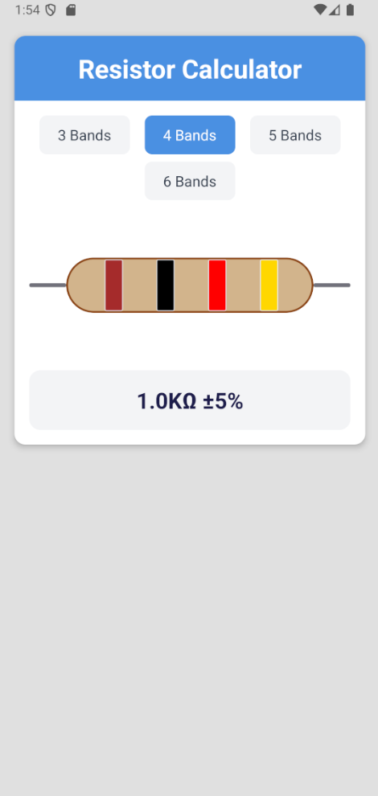

# 📱 Resistor Calculator App  

This project is a **React Native** application that calculates resistor values using color codes.  

  

---  

## 🚀 Features  
✅ Calculate resistor values using color codes  
✅ Live preview with instant results  
✅ User-friendly and mobile-responsive interface  

---  

## 📥 Installation  
Clone the project:  
```sh
git clone https://github.com/username/resistor-calculator.git  
cd resistor-calculator  
npm install  
```  
To run the project:  
```sh
npx expo start
```

---  

## 📸 Screenshots  
| Home Screen | Result Screen |  
|-------------|---------------|  
|  |  |

---  

## ⚙️ Technologies  
- React Native  
- Expo  
- JavaScript  

---  

## 🤝 Contributing  
1. Fork the repository 🍴  
2. Create a new branch:  
   ```sh
   git checkout -b new-feature  
   ```  
3. Commit your changes:  
   ```sh
   git commit -m "Added new feature"  
   ```  
4. Push to GitHub:  
   ```sh
   git push origin new-feature  
   ```  
5. Open a **Pull Request (PR)**.  

---  

🚀 **Happy coding!** 🎨🔧⚡  
```